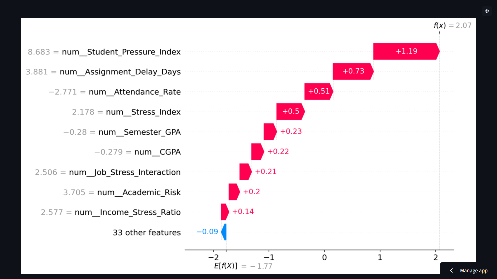

# Student Dropout Risk Prediction

[](https://student-management-system-dropout-prediction.streamlit.app)
[](https://python.org)
[](https://scikit-learn.org)

> A deployed ML system that predicts student dropout risk, explains every prediction with SHAP, and serves results through a live Streamlit app.

**[Try the Live Demo →](https://student-management-system-dropout-prediction.streamlit.app)**


---

## Problem

Universities struggle to identify at-risk students early enough for meaningful intervention. Traditional rule-based systems catch only obvious signals like low GPA — they miss students dealing with financial stress, disengagement, or compounding socioeconomic challenges.

## Solution

A fully deployed ML system — not just a model — that predicts dropout risk from 18 domain-specific features, explains the reasoning behind each prediction, and collects feedback for continuous improvement.

| | |
|---|---|
| **Data** | 10,000+ student records across academic, socioeconomic, and institutional dimensions |
| **Accuracy** | 82% on held-out test data with ROC-AUC of 0.88 |
| **Deployment** | [Live Streamlit app](https://student-management-system-dropout-prediction.streamlit.app) — interactive predictions + SHAP explanations |
| **Stack** | scikit-learn · XGBoost · SHAP · Streamlit · pytest |

---

## Pipeline

```
Student Profile → Preprocessing → Model → Prediction + SHAP → Feedback Loop
  (18 features)    scikit-learn    Logistic Regression    At-Risk /        Retrain
   via Streamlit     Pipeline       (Tuned, GridSearchCV)  Will Persist     with labels
```

- **Features:** Academic (GPA, attendance, study hours) · Socioeconomic (income, internet, scholarships) · Institutional (semester, department)
- **Preprocessing:** Imputation → StandardScaler → OneHotEncoder via `ColumnTransformer`
- **Training:** GridSearchCV with 5-fold CV, ROC-AUC optimized, stratified splits, balanced class weights
- **Explainability:** Per-prediction SHAP waterfall + global feature importance
- **Feedback:** Ground truth corrections saved for scheduled retraining

---

## Results

| # | Model | Accuracy | F1 | ROC-AUC |
|---|-------|----------|-----|---------|
| 1 | XGBoost (Tuned) | 0.8225 | 0.8101 | 0.8841 |
| 2 | Random Forest (Tuned) | 0.8206 | 0.8070 | 0.8814 |
| 3 | XGBoost (Baseline) | 0.8191 | 0.8048 | 0.8796 |
| **→** | **Logistic Regression (Tuned)** | **0.8175** | **0.8013** | **0.8763** |
| 5 | Logistic Regression (Baseline) | 0.8154 | 0.7992 | 0.8742 |
| 6 | Random Forest (Baseline) | 0.8095 | 0.7900 | 0.8624 |

**→ Selected: Logistic Regression (Tuned)** — comparable to ensemble models, fully interpretable, 0.12 ms inference. When stakeholders need to trust the output, interpretability wins over marginal accuracy.

Detailed metrics, confusion matrices, and feature importance: [`results/MODEL_METRICS.json`](results/MODEL_METRICS.json)

---

## Key Highlights

| | |
|---|---|
| **Interpretability** | SHAP at global + individual level — every prediction is explainable |
| **Rigor** | 6 models benchmarked, hyperparameter-tuned, stratified evaluation |
| **Deployment** | Live Streamlit app serving real-time predictions with SHAP visualizations |
| **Feedback loop** | Advisor corrections feed back into retraining pipeline |
| **Modular code** | Clean Python package — `features.py`, `training.py`, `evaluate.py` |
| **Responsible AI** | Built to identify students for support, not exclusion — bias monitoring included |



---

## What Sets This Apart

This is not another dropout-prediction notebook. It's a complete ML system with production-level thinking:

- **Real-scale data** — trained on 10,000+ records, not a toy dataset
- **Domain-engineered features** — 18 attributes designed around academic, socioeconomic, and institutional risk factors
- **Systematic model selection** — 6 models (3 families × baseline + tuned) benchmarked and compared
- **Explainability built in** — SHAP integration at both global and per-prediction level
- **Deployed and live** — Streamlit app on cloud, not just a local notebook
- **Feedback loop** — ground truth collection for retraining, designed for continuous improvement

---

## Business Impact

The patterns in this project — risk classification, explainability, feedback-driven retraining, deployed UI — translate directly across domains:

| Domain | Parallel |
|--------|----------|
| **Finance** | Loan default prediction, fraud detection |
| **SaaS** | Churn prediction, customer health scoring |
| **Healthcare** | Patient risk stratification, readmission prediction |
| **E-commerce** | Recommendation systems, retention modeling |

The core competencies are the same: translating a business problem into an ML objective, building reproducible pipelines, choosing interpretability when stakeholders need trust, and designing systems that improve over time — not just models that score once.

---

## Demo

The Streamlit app delivers a complete prediction flow:

1. Enter a student profile across 3 tabs (Academic / Environmental / Institutional)
2. Get a prediction — At-Risk or Will Persist — with confidence score
3. View the SHAP breakdown showing which features drove the result
4. Submit feedback for retraining

 -->

An optional CLI is also available for bulk data entry: `python -m student_management`

---

## Quick Start

```powershell
python -m venv .venv
.\.venv\Scripts\Activate.ps1
pip install -r requirements.txt

python -m student_management.training   # train models
streamlit run streamlit_app.py          # launch app
```

Helper script: `.\scripts\run_demo.ps1`

---

## Project Structure

```text
student-management-system/
├── student_management/        # Core ML package
│   ├── features.py            # Preprocessing pipeline
│   ├── training.py            # Model training & tuning
│   ├── evaluate.py            # Metrics & evaluation
│   ├── core.py                # Validation & data collection
│   ├── cli.py                 # CLI interface (optional)
│   └── data_ingest.py         # Data loading
├── streamlit_app.py           # Deployed web UI
├── data/                      # Datasets & feedback
├── models/                    # Saved model artifacts
├── notebooks/                 # EDA, modeling, explainability
├── results/MODEL_METRICS.json # Full metrics artifact
├── scripts/run_demo.ps1       # Demo launcher
└── tests/                     # pytest suite
```

---

## Training & Testing

```powershell
python -m student_management.training                                                                  # train
python -c "from student_management.evaluate import evaluate_model; evaluate_model('models/logistic_tuned')"  # evaluate
pytest tests/ -q                                                                                        # test
```

---

## Roadmap

- [ ] Optuna for advanced hyperparameter search
- [ ] Model monitoring (Prometheus/Grafana)
- [ ] Auto-retraining via GitHub Actions
- [ ] FastAPI REST endpoint
- [ ] Multi-institution support with privacy-preserving learning

---

## Troubleshooting

| Issue | Fix |
|-------|-----|
| Model file not found | Run `python -m student_management.training` first |
| Slow first load | SHAP init is heavy on first run — refresh and it's fast |
| SHAP plots missing | `pip install shap xgboost --upgrade` |
| CSV not saving | Ensure `data/` folder exists with write permissions |

---

**Built by [Yuval Shah](https://github.com/yuvalshahtech)** · v2.0.0 · [Live Demo →](https://student-management-system-dropout-prediction.streamlit.app)

*Building end-to-end ML systems — from data pipelines to deployed products.*
